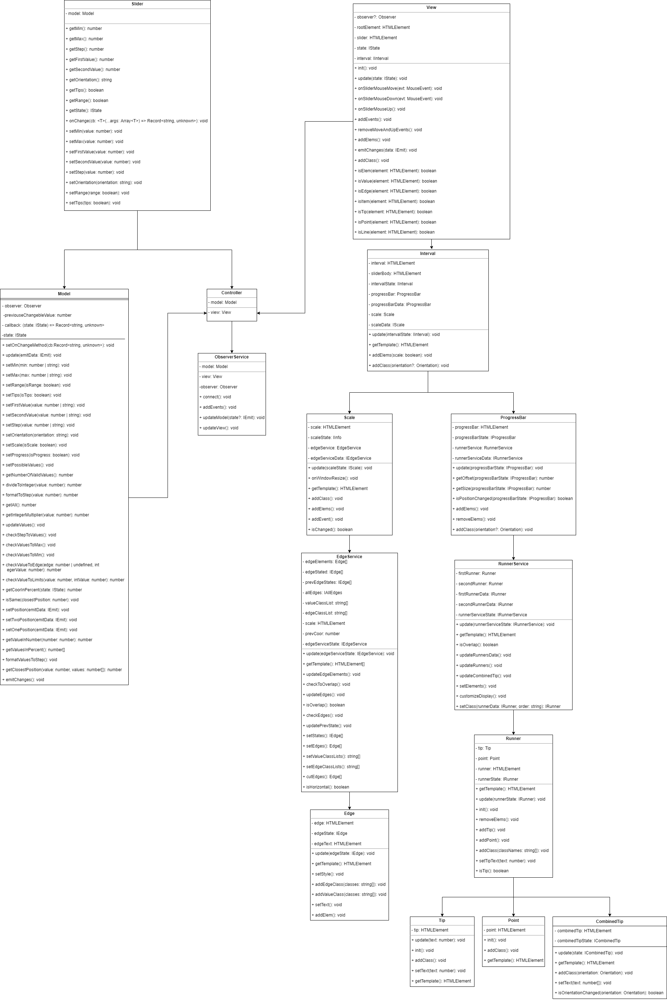

# range-slider

### Установка

    git clone https://github.com/Arlincourt/range-slider.git
    npm install
    
### Команды

    npm run prod // финальная сборка проекта
    npm run dev // сборка в режиме разработки
    npm run start // запуск сервера разработки
    npm run test // запуск тестов
    npm run lint // запуск eslint
    npm run lint-fix // запуск автоматического исправления eslint
    
### Использование

    $('#slider').slider() // опции по умолчанию
    $('$slider').slider({ // передаваемые опции
      tips: true,
      range: true,
      orientation: 'HORIZONTAL',
      min: 0,
      max: 100,
      values: [0, 100],
      step: 1
    })
    
### Дата-аттрибуты
 Можно использовать дата-аттрибуты, плагин считает их и применит

    //html
    <div id="slider" data-tips="true" data-range="true" data-orientation="HORIZONTAL" data-min="0" data-max="100" 
      data-step="1" data-values="[0, 100]"
      
    //scripts
    
    $('#slider').slider()
      
### События
Можно подписаться на событие на изменения слайдера. В эту функцию будет передаваться состояние слайдера
    
    function onSliderChange(sliderState) {...}
    $('#slider').slider({some options})
    $('#slider').slider('onChange', onSliderChange)
    
### Конфигурация

1. **tips** - Показывать или нет подсказки. Принимаемое значение - boolean
2. **range** - Одиночное значение или интервал. Принимаемое значение - boolean
3. **orientation** - Вертикальный или горизонтальный вид. Принимаемое значение - "HORIZONTAL" или "VERTICAL"
4. **max** - Максимальное значение, которое может принимать слайдер. Принимаемое значение - number
5. **min** - Минимальное значение, которое может принимать слайдер. Принимаемое значение - number
6. **step** - Шаг слайдера. Принимаемое значение - number
7. **values** - Значения первого и второго ползунков. Принимаемое значение - массив, состоящий из двух цифр

### API
    
    $('#slider').slider() // опции по умолчанию
    $('#slider').slider('setMin', number) // принимает number вторым аргументом
    $('#slider').slider('setMax', number) // принимает number вторым аргументом
    $('#slider').slider('setStep', number) // принимает number вторым аргументом
    $('#slider').slider('setFirstValue', number) // принимает number вторым аргументом
    $('#slider').slider('setSecondValue', number) // принимает number вторым аргументом
    $('#slider').slider('setRange', boolean) // принимает boolean вторым аргументом
    $('#slider').slider('setTips', boolean) // принимает boolean вторым аргументом
    $('#slider').slider('setOrientation', string) // принимает string("HORIZONTAL" или "VERTICAL") вторым аргументом
    
    $('#slider').slider('getMin')
    $('#slider').slider('getMax')
    $('#slider').slider('getStep') 
    $('#slider').slider('getFirstValue') 
    $('#slider').slider('getSecondValue') 
    $('#slider').slider('getRange') 
    $('#slider').slider('getTips') 
    $('#slider').slider('getOrientation') 
  
 ### Используемые технологии
 
 1. **jQuery**
 2. **Typescript**
 3. **webpack**
 4. **JEST**
 5. **SCSS**
 6. **PUG**

 ### Версии зависимостей

 1. jQuery - **^3.6.0**
 2. Typescript - **^4.4.3**
 3. Pug - **^2.0.4**
 4. SCSS - **^6.0.1**
 5. Webpack - **^5.44.0**
 6. Webpack-cli - **^4.7.2**
 7. Webpack-dev-server - **^3.11.2**
 8. npm - **7.20.3**
 9. node - **v16.6.2**
 
 ### Отвязка слоев
 
 Отвязка слоев происходит за счет паттерна Наблюдатель. Каждый раз при изменении Модель и Вид эмитят, что произошли изменения, с помощью Контроллера, который их связывает,
 Модель или Вид, в зависимости от того, кто эмитил, узнает об этом и изменяется.
 
 ### Диаграмма
 
 